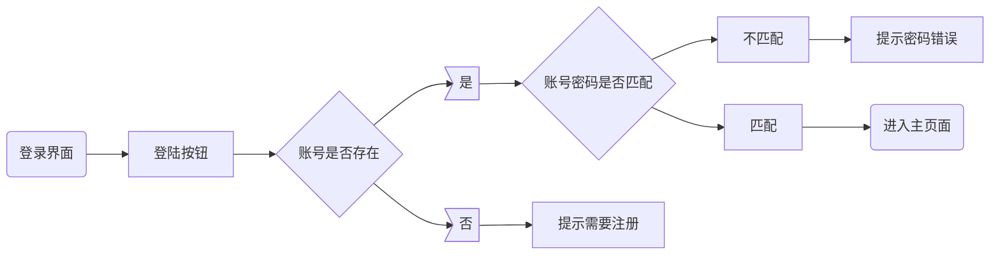
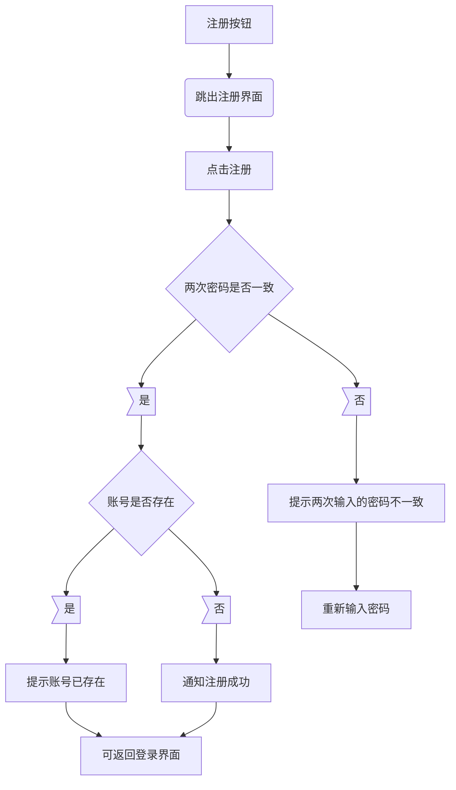
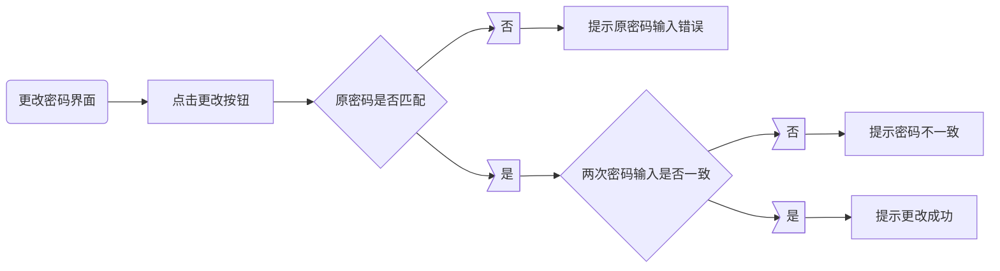
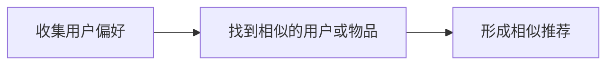

持续时间为：**5.1-5.14**，5.14qian将资料打包发到继元师兄邮箱 giyn.jy@gmail.com(代码文件，数据库.sql文件，答辩ppt，详细文档(.docx和.pdf各一份)，项目演示视频以及其他文件（如论文阅读报告）)

代码文件按功能进行文件夹上的分类。

本次考核主要分为三大模块：

（1）爬虫和数据库模块

（2）书籍推荐系统模块

   (3)  差分隐私保护模块

​        书籍推荐系统，**爬取豆瓣书籍数据**，根据书籍相关数据，**设计并实现相关推荐算法**，构建出**图形用户界面**（GUI）进行交互。书籍推荐系统，需要针对数据集中的用户推荐相关书籍，同时**应用差分隐私算法对系统中的数据进行保护**。

# 基础任务要求、难度分析、分解

## 爬虫与数据库模块：

1.了解提供的数据的字段特点，属于什么类型

2.将sql文件导入进数据库，以便后序算法提取数据

**难度低。**

1观察数据写入markdown记录即可，2搜索一下应该就会出来

## 书籍推荐模块：

具有较好的交互性，系统运行流畅，具有一定的健壮性

GUI界面开发：PyQt5

​	**①登录注册界面**

​    用户注册账号和登陆页面。

​	**②用户主界面**

​	数据集中不同用户结合数据根据推荐算法得到不同的书籍推荐，还有热门书籍等信息。

​	**③书籍分类搜索界面**

​	可以根据书籍分类或者根据书籍名称进行搜索

​	**④书籍详情界面**

​	结合已有书籍数据，构建书籍详细页面。

​	**⑤用户个人界面**

​	简单个人信息，修改登录密码等。

​	**⑥软件细节功能**

​    可以自行拓展

### 分解：

#### 1.用户注册及登录

说明需要用文件对用户的数据进行记录，这里的数据应该会有：

用户的账号，密码，可以存在csv中或sql中

注册时喜欢书籍的类型（是否可取消？），近期种草了什么书

文件名就叫user_info吧

#### 2.用户主界面

主界面应**左右分区**，分为**个性化推荐**及**热门电影推荐**。

个性化推荐采用ItemCF推荐算法，基于物品的协同过滤算法，https://blog.csdn.net/hhjhh76/article/details/81781707

为什么选择ItemCF而不是UserCF？

1.ItemCF着重于维护用户的历史兴趣，推荐更加个性化，反映了用户自己的兴趣传承

2.ItemCF可以利用用户的历史行为给推荐结果提供推荐解释

3.互联网中**物品的相似度**相对于用户的兴趣一般**比较稳定**，UserCF中用户相似度矩阵相比ItemCF中物品相似度矩阵更新更频繁

4.一旦新用户对某物品产生行为，**ItemCF可以给该新用户推荐和该物品相似的物品**，而UserCF无法很好地给新加入的用户产生推荐，因为现在User还没有产生任何行为

5.且互联网中使用ItemCF比较多。

算法的改进：

1.活跃度

Item-IUF，活跃用户对物品相似度的贡献应小于不活跃用户，所以文件还可以记录用户每次登录或操作的时间（以时间戳形式）

这个是以整体视角审视推荐系统的

#### 3.书籍分类搜索界面

需要设置 输入栏 和 搜索🔍按钮

输入书籍名称，分三种排序方式显示：1.默认	2.出版年份	3.评分高低	

需支持模糊搜索，这个应该挺好做的？检索的文字是否存在于item的题目

最多显示4页，每页5个，每条搜索结果的信息大概是这样子

封面图，书名，评分，作者，

有三个按钮分别对应三种排序方式，点击后将重新排序显示

#### 4.书籍详情界面

个人感觉这个也挺简单的，根据搜索页面或主页面处进入该书，显示书籍信息

分为三块区域，从中间分割成上下，上左放书封面图，上右放除简介的信息，如书名，评分，出版商，出版年份

下半区域放简介

字体的话我觉得都用宋体

这里的话，信息要在处理时规范成一定数据

还要加一个❤表示喜欢这本书

还可以给用户在这里有一个**评论**功能，之后进入该书都会显示在这里

#### 5.用户个人界面

展示个人信息：用户名，近期喜欢的书，自己评论过的书

其他功能：写一段自我介绍，修改密码

难度：困难！算法大概2天能搞懂？PyQt界面学习与实践要5天吧。

$$
w_{i j}=\frac{|N(i) \cap N(j)|}{\sqrt{|N(i)||N(j)|}}
$$

$$
P_{uj}=\sum_{i \in N(u)\cap S(j,k)} w_{ji}r_{ui}
$$

$$
w_{ij} = \frac{C[i][j]}{\sqrt{N[i]\cdot N[j]}}
$$

# 进阶任务及难度分析

## 爬虫与数据库模块

需求：

1.不使用提供的数据，而是自己爬取书籍和用户数据，建议>3000本，考虑的用户>500个

2.用数据库存取数据

### 分解：

1.确定好需要爬取的字段（书籍类型一定要！虽说那个网页上没有）

2.熟悉数据库在python中的读取插入数据（怎么被其他文件调用）

3.毕竟需要短时间内爬大量数据，所以要熟悉**代理的使用**

4.由于douban的反爬虫还是做的挺好的，小心行事。

## 书籍推荐模块

需求：

1. 书籍分类搜索界面实现模糊搜索功能（只输入部分信息也可得到查询结果）
2. 不使用推荐算法库函数，而是自行了解原理并实现
3. 考虑用户冷启动的情况，即为新注册的用户该如何进行推荐
4. 系统美观性，参考市面上已有的软件进行系统界面的美化
5. 将该系统打包为桌面应用exe
6. 自行拓展

### 分解：

3.让用户选择喜欢的书籍类型，根据类型进行推荐

4.可进各大网页及软件观摩

5.csdn搜一搜就出来了

## 差分隐私保护模块

1. 阅读我们提供论文并进行阅读报告的撰写，阅读报告的形式为精简版论文形式，要求全英记录（模板见附件3，供参考，可以更换或者修改内容）
2. 将论文中的算法进行复现，并应用于构建的推荐系统中
3. 使用论文的指标，对该算法进行评估，证明算法的有效性（文档中体现）

### 分解：

1.先了解协同过滤和差分隐私基础概念后再阅读文章

如果要做的话，个人觉得要**1.5天**的时间

# 善后

文档：

制作流程图+公式

尽可能用图来展示流程

QG考核心得（字数要多，越多越好，越能体现出对QG狂热的爱）

PPT：

答辩时长为5分钟，有能力的可以添加一分钟的演示视频

**答辩不要超时！**

# 时间规划

书籍推荐模块

学习PyQt5需要2天？

基于用户的协同过滤算法ItemCF学习需要2天？

实现界面需要2.5天？

