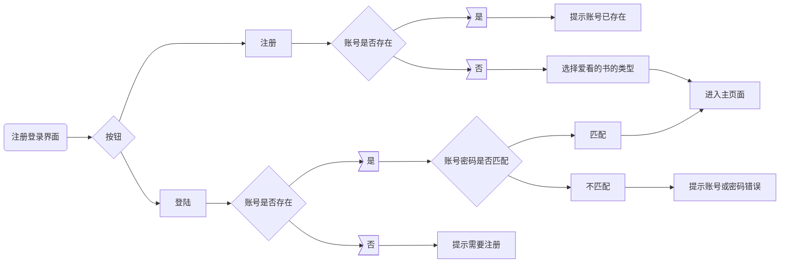

# 开发过程

## 1.界面制作

该库的学习过程可移步至learn_pyqt5.md文件

### 1.登录/注册界面

```python
import res  # 导入资源文件
import sys
from PyQt5.QtGui import QIcon
from PyQt5.QtWidgets import QLabel, QHBoxLayout, QVBoxLayout, QWidget, QLineEdit, QPushButton, QGridLayout


class Demo(QWidget):
    def __init__(self):
        super(Demo, self).__init__()
        self.resize(400, 200)  # 窗口尺寸
        self.setWindowTitle('豆瓣书籍推荐系统')  # 设置窗口标题
        self.setWindowIcon(QIcon(':res/douban.ico'))  # 设置窗口图标
        self.user_label = QLabel('用户名:', self)  # 文本设置
        self.pwd_label = QLabel('密码:', self)
        self.user_line = QLineEdit(self)  # 单行文本编辑器
        self.pwd_line = QLineEdit(self)
        self.login_button = QPushButton('登录', self)  # 按钮
        self.signin_button = QPushButton('注册', self)

        # 布局实例化
        self.g_layout = QGridLayout()  # 网格布局
        self.h_layout = QHBoxLayout()  # 水平布局
        self.v_layout = QVBoxLayout()  # 垂直布局

        self.layout_init()

    def layout_init(self):
        """布局设置，目的是使init方法看起来简洁
        """

        self.g_layout.addWidget(self.user_label, 0, 0, 2, 1)  # 加入控件
        self.g_layout.addWidget(self.user_line, 0, 1, 2, 1)
        self.g_layout.addWidget(self.pwd_label, 1, 0, 2, 1)
        self.g_layout.addWidget(self.pwd_line, 1, 1, 2, 1)

        self.h_layout.addWidget(self.login_button)  # 添加登录按钮
        self.h_layout.addWidget(self.signin_button)  # 添加注册按钮
        self.v_layout.addLayout(self.g_layout)  # 将布局添加到框的末尾
        self.v_layout.addLayout(self.h_layout)

        self.setLayout(self.v_layout)
```

#### 1.g_layout.addWidget

我用的是重载版本，可通过Qt assistant知其详细用法


该单元格将从fromRow, fromColumn开始，跨越rowSpan行和columnSpan列。该小组件将有给定的对齐方式。

会比之前常用的那个addWidget好看

#### 2.数据库操作

查询结果的时候老是说不存在这个列

回去W3School看了看，在jupyter lab上试了一下，结果发现要加引号


那个'Horace'不加()也行

3.登录bug


我起初以为又是我的sql语句写错了，根据上面那个来看，显然不是。

只好print('hello world')一句一句debug了。

找出来了。是一个条件判断出的错。


~~self.account_present虽说我也不知道错哪了，但确实不能这样写。~~fuck。我突然想起来我前面的变量名写的是account_presence


登录界面/注册界面已经编写完毕。



上述的流程图所提到的功能已实现。

### 2.主页面

由于设想的是**左右分区**，分为**个性化推荐**和**热门书籍推荐**

个性化推荐就要涉及算法和数据的爬取了，所以要去编写算法和爬虫

热门书籍的话也要涉及爬虫。

所以先爬虫吧。

有些特征是书都共有的：我们爬取这些字段。

作者，出版社，出版年，页数，定价，装帧，ISBN。

有些难爬...如果贸然追求数据精度会导致时间上极大的消耗。

我个人觉得还是先看懂算法，需要什么样的数据就自然浮出水面。

### 3.搜索🔍页面

csdn上查到了pd['特征'].str.contains可以实现模糊搜索功能。

做完了。还实现了三个显示方式，默认，评分（降序），评分人数（降序），其中降序功能点一次会变升序，挺简单的。原理其实很简单。

### 4.书籍📕详情页面

因为要显示图片，所以要用Qpixmap这个类。

我们去看看图片


**共有3000本书**，只有**2988张图片**，点击一张图片，查看属性，发现是png，再搜索.png，发现png格式的是2982张。

所以在读取图片时有一定的困扰。经过代码检验和查找

发现不是png文件的，它压根就不是图片！！！

不是，这怎么放进来的啊。


~~《原来如此》~~

由于数量比较少，只有六张，那我就一张一张删掉好了。

这样处理的情况就变少了。

观察到有某些特征数据缺失


